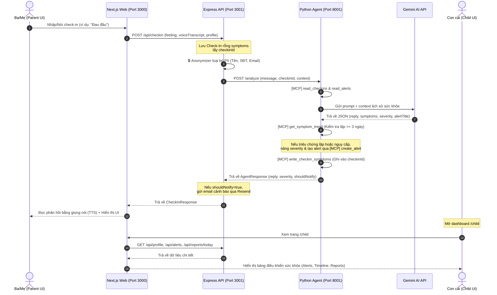

# 🏁 Hướng Dẫn Vận Hành & Kiểm Thử Toàn Diện: FamilyCare Agent

Tài liệu này xác nhận trạng thái mã nguồn hiện tại, giải thích chi tiết **Cách hoạt động của hệ thống (System Flow)**, và cung cấp **Kịch bản kiểm thử từng bước (Testing Scenarios)** để bạn chạy thử nghiệm toàn bộ hệ thống từ parent check-in cho đến child dashboard.

---

## 📈 Trạng Thái Mã Nguồn Sau Khi Sửa Lỗi

Các lỗi nghiêm trọng trước đây đã được giải quyết triệt để:
1.  **Sửa lỗi Race Condition (Ghi đè triệu chứng):**
    *   *Cách hoạt động mới:* Khi ba mẹ check-in, [checkin.ts](file:///d:/STUDY/learn_google/familycare-agent/apps/api/src/routes/checkin.ts#L54-L70) sẽ lưu check-in trước (với triệu chứng rỗng) để lấy `checkinId` hợp lệ, sau đó truyền `checkinId` này sang Python Agent.
    *   Phía Python Agent sử dụng [write_checkin_symptoms](file:///d:/STUDY/learn_google/familycare-agent/python/agents/health_agent.py#L330-L342) cập nhật triệu chứng vào chính xác ID này thay vì lấy bản ghi cuối cùng `recent[0]`.
2.  **Sửa lỗi Timezone (Lệch múi giờ):**
    *   Phía MCP server ([health_mcp.py](file:///d:/STUDY/learn_google/familycare-agent/python/mcp_servers/health_mcp.py#L23-L248)) sử dụng múi giờ Việt Nam `VN_TZ = timezone(td(hours=7))` để tính toán ngày cutoff 7 ngày gần nhất và tính số ngày bị bỏ lỡ chính xác.
3.  **Hoàn thiện đồng bộ Profile và Dashboard cho Con `/child`:**
    *   Tạo thành công trang Dashboard vô cùng đẹp mắt và đầy đủ tính năng tại [child/page.tsx](file:///d:/STUDY/learn_google/familycare-agent/apps/web/src/app/child/page.tsx).
    *   Tích hợp và đăng ký router `/api/profile` trong [index.ts](file:///d:/STUDY/learn_google/familycare-agent/apps/api/src/index.ts#L34-L37) của Express API, giúp Dashboard của con có thể tải được thông tin xưng hô của ba mẹ (`Ba/Mẹ/Ông/Bà`) từ server.

---

## ⚙️ Cách Hoạt Động Của Hệ Thống (System Architecture)

Luồng đi của dữ liệu khi ba mẹ thực hiện check-in diễn ra qua các bước sau:



---

## 🧪 Hướng Dẫn Chạy & Kiểm Thử Toàn Diện (Testing Guide)

### 📦 Bước 1: Khởi động hệ thống
Bạn cần chạy đồng thời cả 3 dịch vụ: Express API, Python Agent, và Next.js Frontend.

1.  **Cài đặt thư viện (nếu chưa chạy):**
    ```bash
    pnpm install
    ```
2.  **Khởi động Express API & Next.js Frontend (sử dụng Turbo):**
    ```bash
    # Chạy lệnh tại thư mục root
    pnpm run dev
    ```
3.  **Khởi động Python Agent:**
    *   Mở một Terminal mới.
    *   Truy cập vào thư mục `python` và kích hoạt môi trường ảo:
        ```powershell
        cd python
        .\venv\Scripts\activate
        pip install -r requirements.txt
        python run.py
        ```
        *(Python Agent sẽ chạy tại địa chỉ http://localhost:8001)*
4.  **Kiểm tra kết nối:**
    *   Mở trình duyệt truy cập: `http://localhost:3001/api/ping`
    *   Kết quả trả về dạng JSON có trường `"pythonAgent": "ready"` là kết nối thành công.

---

### 📝 Bước 2: Kịch bản kiểm thử thủ công (Manual Test Scenarios)

Hãy làm sạch dữ liệu cũ trước khi test bằng cách xóa các file trong thư mục `apps/api/data/` (nếu cần thiết). Sau đó thực hiện lần lượt các kịch bản sau:

#### Kịch Bản 1: Thiết lập ban đầu (Setup)
1.  Truy cập giao diện: `http://localhost:3000/` (hệ thống sẽ tự động chuyển hướng về `/setup` do chưa có cấu hình).
2.  **Điền thông tin:**
    *   *Người thân:* Chọn **Ba** 👨‍🦳, tên: **Nguyễn Văn Năm**.
    *   *Người chăm sóc:* Tên con: **Nam**, email nhận thông báo: Email thật của bạn (để test nhận email, hoặc email đăng ký Resend).
3.  Bấm **Bắt đầu!**.
4.  **Kết quả mong đợi:** Giao diện chuyển sang trang `/parent`. Kiểm tra trong thư mục `apps/api/data/` xuất hiện file `profile.json` chứa thông tin vừa tạo.

---

#### Kịch Bản 2: Check-in Bình Thường ("Khỏe")
1.  Tại giao diện `/parent`, bấm nút **KHỎE** 😊.
2.  **Kết quả mong đợi:**
    *   Màn hình hiển thị: *"Con mừng khi nghe Ba khỏe!..."*.
    *   Loa phát âm thanh đọc to câu phản hồi bằng tiếng Việt (Text-to-Speech).
    *   Kiểm tra file `checkins.json` ghi nhận cảm xúc `good`, danh sách triệu chứng rỗng (`symptoms: []`).
    *   Không có email cảnh báo nào được gửi đi.

---

#### Kịch Bản 3: Check-in Có Triệu Chứng Nhẹ ("Không Khỏe")
1.  Tại giao diện `/parent`, chọn nút **NÓI CHO CON NGHE** 🎤 (hoặc gõ/nói tin nhắn): *"Hôm nay ba hơi bị đau đầu"* rồi chọn cảm xúc **KHÔNG KHỎE** 😔.
2.  **Kết quả mong đợi:**
    *   Mô hình Gemini phân tích tin nhắn và trích xuất ra triệu chứng: `["đau đầu"]`.
    *   Màn hình hiển thị phản hồi khuyên ba nghỉ ngơi ấm áp.
    *   Kiểm tra file `checkins.json`, bản ghi mới nhất phải có `symptoms: ["đau đầu"]`.
    *   **Quan trọng:** Kiểm tra bản ghi check-in "Khỏe" trước đó **không bị ghi đè hay thay đổi**.

---

#### Kịch Bản 4: Kiểm tra xu hướng triệu chứng (Symptom Trend - Nâng cấp Alert)
Chúng ta sẽ giả lập tình trạng ba bị đau đầu liên tiếp 3 ngày để kiểm tra tính năng tự nâng cấp mức độ cảnh báo (consecutive symptoms).

1.  Mở file `apps/api/data/checkins.json` ra chỉnh sửa (để test nhanh không cần chờ 3 ngày):
    *   Tạo thêm 2 bản ghi check-in cho 2 ngày trước đó (ví dụ: ngày hôm qua và hôm kia).
    *   Cả 2 bản ghi đều để `symptoms: ["đau đầu"]`, `feeling: "bad"`.
2.  Quay lại giao diện `/parent`, check-in lần nữa với tin nhắn: *"Hôm nay vẫn còn nhức đầu nhiều quá"*.
3.  **Kết quả mong đợi:**
    *   Gemini nhận diện triệu chứng `"đau đầu"`.
    *   Python Agent gọi tool `get_symptom_trend`, phát hiện triệu chứng đau đầu xuất hiện 3 ngày liên tiếp.
    *   Agent tự động nâng mức độ nghiêm trọng lên `high`, kích hoạt trạng thái `shouldNotifyChild = true`.
    *   Express Backend tạo một cảnh báo dạng `SYMPTOM_CONSECUTIVE` lưu vào `alerts.json`.
    *   Một email được gửi đến hòm thư của con cảnh báo ba bị đau đầu liên tục.

---

#### Kịch Bản 5: Cảnh Báo Khẩn Cấp (SOS)
1.  Tại giao diện `/parent`, bấm nút màu đỏ **GỌI CON NGAY** 🆘.
2.  **Kết quả mong đợi:**
    *   Màn hình chuyển sang màu đỏ cảnh báo khẩn cấp, hiển thị số điện thoại cấp cứu `115`.
    *   Hệ thống gửi ngay lập tức một email tiêu đề đỏ `🚨 [KHẨN CẤP] Cần hỗ trợ khẩn cấp!` tới email của con.
    *   Trong file `alerts.json` xuất hiện bản ghi mới có type: `EMERGENCY`, severity: `emergency`.

---

#### Kịch Bản 6: Dashboard Cho Con (/child)
1.  Truy cập địa chỉ: `http://localhost:3000/child`.
2.  **Kết quả mong đợi:**
    *   Trang hiển thị tiêu đề: *"Theo dõi sức khỏe Ba — Nguyễn Văn Năm"*.
    *   **Tab Cảnh Báo:** Hiển thị danh sách các cảnh báo vừa tạo (như đau đầu liên tiếp, SOS). Bạn có thể bấm nút **"Đã xem"** hoặc **"Đã xử lý"**. Trạng thái này sẽ lập tức cập nhật vào `alerts.json`.
    *   **Tab Lịch Sử:** Hiển thị timeline 14 check-in trực quan, có đánh dấu những ngày ba bị mệt.
    *   **Tab Báo Cáo:** Tổng kết thống kê số lần check-in của ba và nút **"Gửi báo cáo cho Ba"** để gửi email tổng kết trực tiếp.
